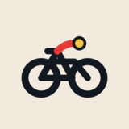

# Simplified favicon candidates

Four bold, low-detail directions designed to remain legible at 16×16 px. The SVG files are the editable masters; PNG and ICO previews are generated from the same vectors. These are candidates only—the active site favicon remains Candidate 01 from the original set until one of these is selected.

## 01 — Minimal route pin

## 02 — Folded route map

## 03 — Cycle route

## 04 — Paw marker

