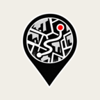
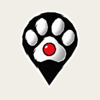

# Dog Map favicon candidates

These earlier candidates are retained for reference. The active site favicon is the selected round route-map concept from `favicon-candidates-v3/02-route-map-no-wheel.png`, copied to `/favicon.ico` and wired into `index.html`.

Each `.ico` includes 16, 32, 48, and 64 px sizes. The matching full-size transparent PNG is retained as the editable source, and `*-preview.png` shows the icon on a light browser-like background.

## 01 — Route pin

## 02 — Folded map and compass

## 03 — Cycling route

## 04 — Dog paw pin

